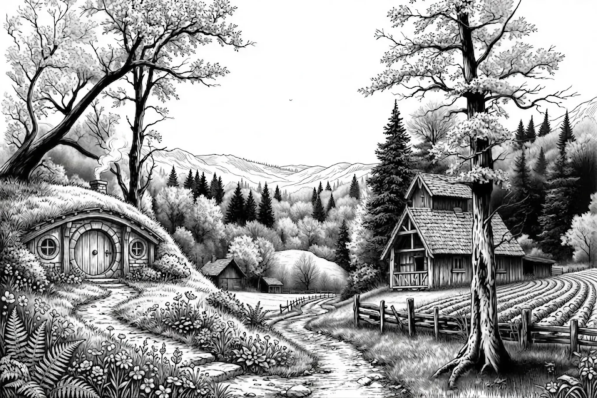
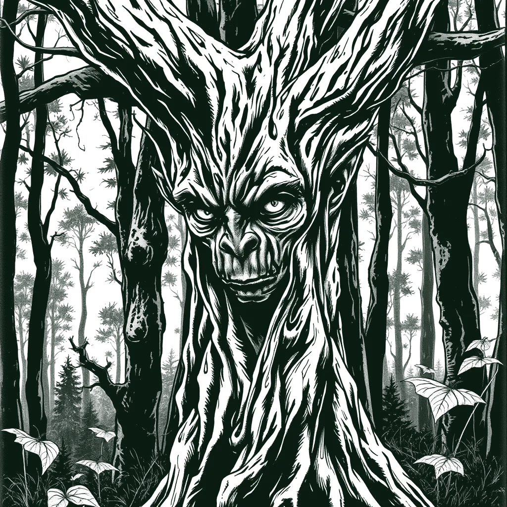
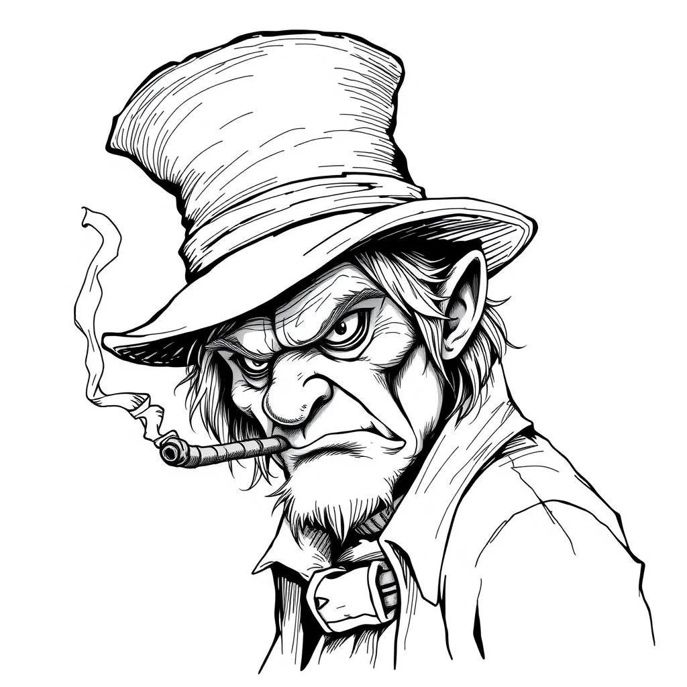
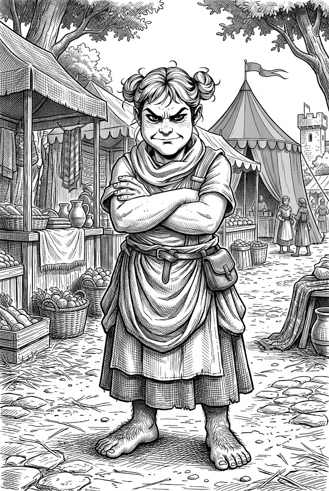
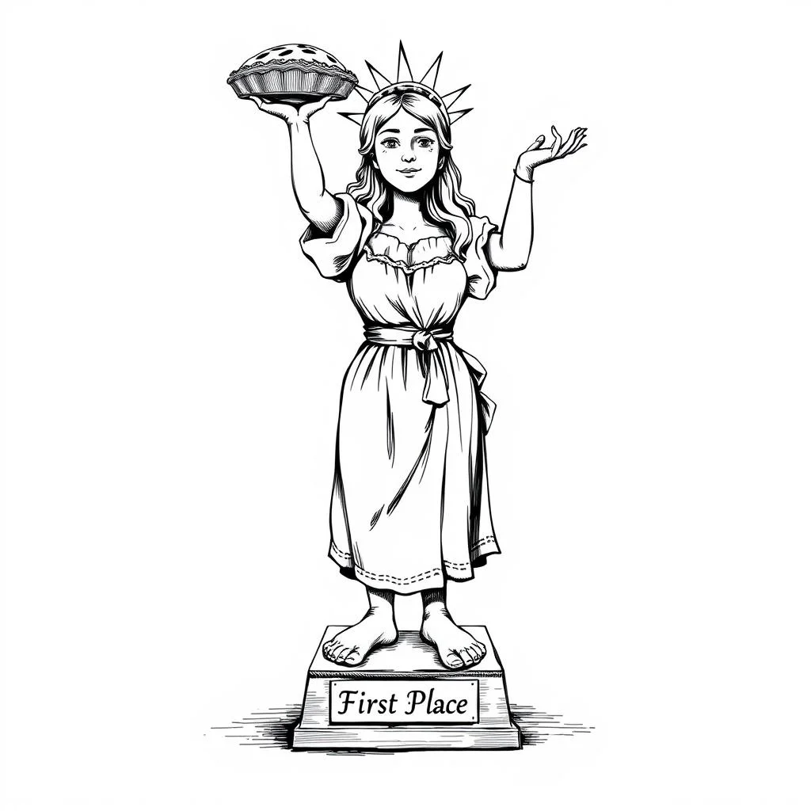
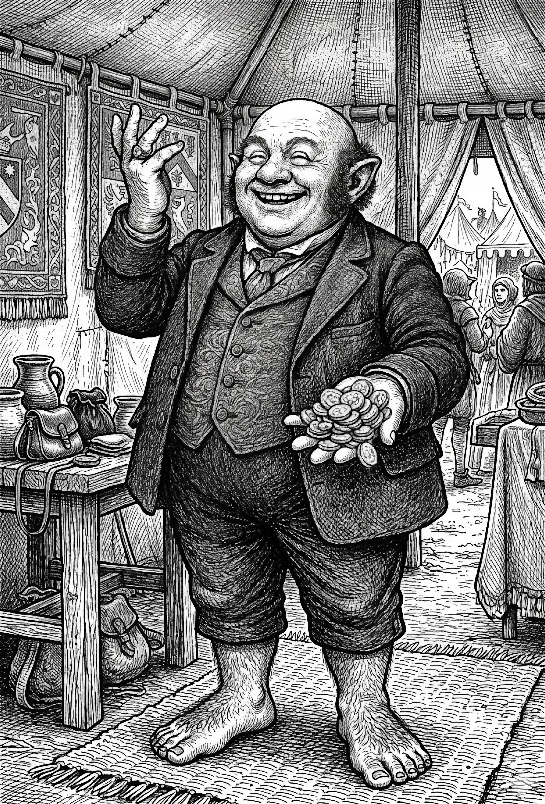
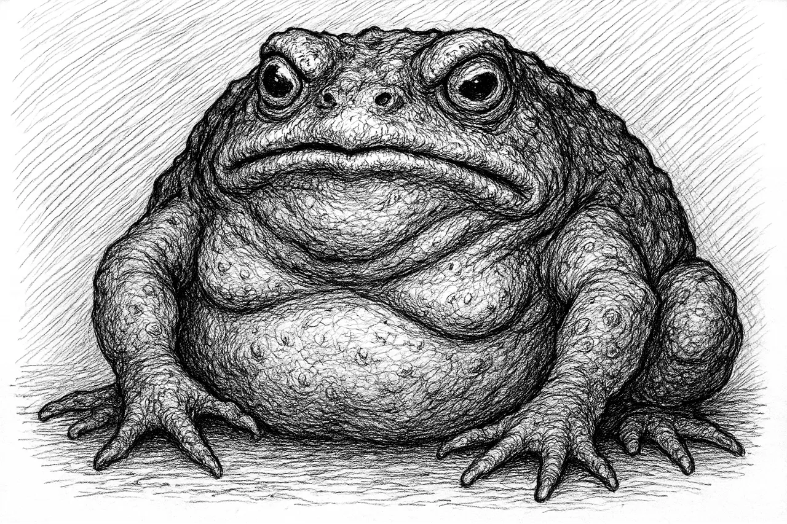
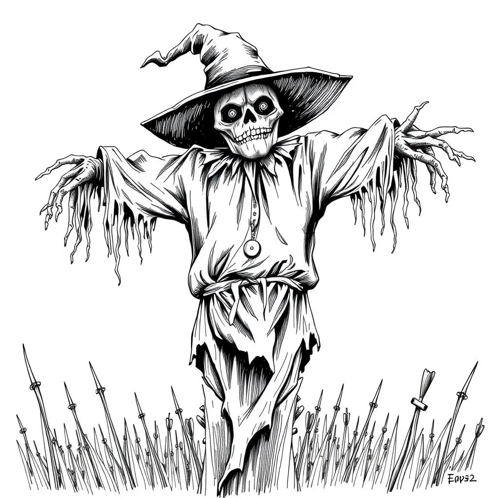

# The Gomwick Harvest Festival

Session Recap – 6 <dfn title="November">Blotmath</dfn>, S.R. 1425

- **PCs:**
  - [Boffo Lunderbunk](/hobbity/appendix/pcs/boffo) - Level 0 Hobbit
  - [Wedge Wedgerton](/hobbity/appendix/pcs/wedge) - Level 0 Hobbit
  - [Turnip Bramblebrook](/hobbity/appendix/pcs/turnip) - Level 0 Hobbit
- **Location:** [Thistledown](/hobbity/appendix/places/#thistledown), the Old Road, [Gomwick](/hobbity/appendix/places/#gomwick)

## The Road to Gomwick

Early morning in the hamlet of Thistledown. Crisp air, the smell of last night's rainstorm still lingering. Three hobbits checked the straps on Binny, their uncle's old pony, loaded with goods to sell at the Gomwick Harvest Festival. A storm had delayed their departure by a day, so the North Road and a warm bed at the Right Way Inn were out. They'd take the Old Road instead—through the forest, one night camping on hard ground, arriving in Gomwick by tomorrow evening with time for the supper feast.

Along the Old Road they stopped at [Farmer Fallow](/hobbity/appendix/npcs/#farmer-fallow)'s Knick-Knack and Produce Road-Side Stall and each picked up a curious item: Wedge found a whistle that seemed to call animals, Boffo chose three feathers that gave him a boost of speed when worn, and Turnip acquired a pair of strange stockings whose purpose remained unclear.

Deeper in the woods, something felt wrong. The trees seemed to watch them—not all at once, but one at a time, a face in the bark that vanished the moment you looked straight at it. The feeling of being _Seen_, not just observed but known, straight to the marrow. Off in the distance, a tall, long-legged figure crossed the road and vanished into the undergrowth without a sound.

They came upon a party of dwarf travelers heading to the same festival, agitated because they'd lost a companion in the woods. The hobbits helped search, pushing deeper into a strange mist that turned the forest into a maze of identical trees and muffled sounds. They nearly got lost themselves before the mist broke and they found the missing dwarf, shaken but unharmed. The dwarves were grateful, and the two groups traveled together the rest of the way to Gomwick as fast friends.

Along the way they encountered [Tobias Chubb](/hobbity/appendix/npcs/#tobias-chubb), a ne'er-do-well who muttered about the trees "looking at him funny."

## The Festival

The festival was everything three young hobbits could want: eating, drinking, games, and more eating. Wedge scored two bullseyes in the axe-throwing with a shiny new axe from [Lotho Longbuck](/hobbity/appendix/npcs/#lotho-longbuck)’s shop. Turnip entered the storytelling competition but missed his quarter-final slot.

The hobbits went to visit the baker—[Daisy Boffin](/hobbity/appendix/npcs/#daisy-boffin), daughter of [Gammy Boffin](/hobbity/appendix/npcs/#gammy-boffin), the pie-eating organizer. A middle-aged hobbit came over to Boffo and took his hand and started shaking it vigorously. “My word, good fellow! That was an impressive display. We haven’t seen the likes of that in many a year! Gammy Boffin’s the name, and I’m the organizer of this year’s pie-eating, and I must say… wow, my boy! Just wow!” He took a moment looking at Boffo with unabashed admiration. “But where is my head?! Here, my lad,” and he handed back the copper coin, a mug of ale, and pinned a little green ribbon to Boffo’s coat that had a little silver pie embroidered on it, and the words ‘Quarter-Finalist’. “This will let you in to the table for tomorrow’s event. The quarter-finals in the morning, the semi-finals in the afternoon, and the big final tomorrow night. You don’t want to miss it, the prize purse for first place is up over 10 gold crowns, last I checked, and might be more by tomorrow. And, my daughter Daisy’s in charge of baking the pies. Her blueberry pies have won first place three years running!”

And at that, a very pretty, blonde and busty hobbit woman, about roughly 20 years old, stepped up beside Gammy, and said, “I heard my name. What are you going on about now, pa?” She shot him an adoring look, then looked over at Boffo.

“Oh, my dear,” said Gammy, “I was just telling, er…pardon, but I don’t even know your name?” He said to Boffo, but carried on speaking to his daughter anyway, “I was telling the lad, that you’re in charge of baking the pies for tomorrow, so even if he loses, he’ll be plenty satisfied with your sweet treats!”

Daisy gave a humph, and said, “Well, he’ll have to go without. I’m making mince-meat for the quarter-finals.” She then gave Boffo a sly wink and said, “If you make it to the finals, I may just have some cherry pie waiting for you!” And with that she gave a small giggle, and bounced off towards a group of other hobbit girls that were standing around chatting nearby.

While nosing around near the baker’s tent, the hobbits spotted Tobias Chubb skulking about with his cronies. Wedge picked a small vial from Chubb’s pocket—poison, meant for the pies. A brawl ensued, and the plot—hatched by [Adelard Potts](/hobbity/appendix/npcs/#adelard-potts) and [Hanna Boggs](/hobbity/appendix/npcs/#hanna-boggs) with Chubb as their agent—was foiled before anyone’s pie was the worse for it.

## The Pie-Eating Contest

The next day, Boffo returned for the contest proper. In the second round he faced [Grunela Bunce](/hobbity/appendix/npcs/#grunela-bunce)—the heavy favorite, a hobbit woman who had won three years running and expected to win a fourth. The pies came out, the whistle blew, and Grunela threw up after the first pie. Boffo cleaned his plates without breaking stride. She did not take the loss well, and later that evening threw an apple at Boffo’s head, unprovoked.

Boffo kept winning. In the final, a smelly fish pie was set before the remaining contestants—a test of stomach as much as appetite. Boffo kept it down. The crowd erupted.

## Buford Niss

After the contest, [Buford Niss](/hobbity/appendix/npcs/#buford-niss)—the Hon. Horace Buford Hockwallop Niss, Esq.—a wealthy, well-traveled old hobbit who lived at Toppo Hill House, the enormous burrow crowning the hill above Gomwick, came to congratulate the hobbits. He’d just won a tidy sum betting on Boffo.

## The Spottle Table

Buford took the hobbits to a gambling table in a lantern-lit tent where a fat, warty toad sat on a velvet cushion at the centre of the action. He fronted them each some gold to play with. The game was Spottle—part dice, part luck, part toad. Players rolled dice across the table, but any die the spottle toad swallowed counted as zero. The toad had preferences. It lunged for certain rolls and ignored others, and half the strategy was reading the creature’s mood.

All three hobbits wound up ahead by the end of the night. Turnip swore the toad was cheating. Wedge tried to intimidate it into compliance, which only made it eat more of his dice. Boffo fed it a crumb of pie and it left his rolls alone for three rounds straight.

## Dinner at Toppo Hill House

Buford invited the hobbits to dinner at Toppo Hill House, his enormous burrow crowning the hill above Gomwick.

“Gather your things, and meet me at the Toppo Hill House.” He walked a little distance where a little carriage was waiting. The carriage looked a bit like a rickshaw but with the seat facing backwards so Buford could see behind him and not the back of the driver or the pony’s ass. He climbed onto the well cushioned and upholstered seat, drawing a wool blanket over his legs, then taking out a gold flask from his pocket and taking a quick drink out of it.

“Don’t tarry!” he called out, as the driver clicked his tongue, and the pony lurched forward.

Buford’s house was easy to spot. Toppo Hill House is a hobbit hole at the top of the hill overlooking Gomwick, and even from down below they could see it was enormous in scope and quite splendid. It crowned the top of the hill, and was at least several stories of burrows with a pleasant little garden and gazebo at the very top.

Over dinner, Buford asked the hobbits to do him a favour: visit an old man living in a cabin deep in the Old Woods—[the Hermit](/hobbity/appendix/npcs/#the-hermit). He gave them a blowgun, sentimental to him, to bring as a gift along with food.

## Hungry Hank

The hobbits made the journey into the woods and back, returning in time for the final evening of the festival.

Then the scarecrow came alive.

“Hungry Hank,” the harvest effigy, ripped free from his pole and rampaged through the fairgrounds. Boffo threw himself off the stage to shield children in Hank’s path and brought the scarecrow low with a torch. Wedge and Turnip froze—or at least, that’s how the crowd remembered it.

Once the dust had settled a bit, a few narratives began to take hold amongst the crowd. Gammy went up on stage imploring everyone to calm down, trying to convince people that Hungry Hank had simply caught fire early, and then that fire had caused it to come loose from the pole to which he was tied. He pointed out that it didn’t move far at all, and what was being claimed to have been ‘Hank’s Rampage’ in reality was just Hank falling over very slowly.

And indeed, before long this version of the story took root since the vast majority of people were not close by to Hank and just either saw the whole thing from a distance, or heard about it second or third hand. Within the hour, the story was that people were being ridiculous to suggest that Hank could’ve come alive at all, and they’d just had too much cider and beer for their own good sense.

However, within that narrative, another thread was being spun about Boffo specifically. People were talking about how he selflessly threw himself off the stage to protect the children in Hank’s path as best he could, and then heroically stopped Hank’s dangerous advance by fanning the flames and bringing the scarecrow low with the use of a torch, in complete disregard for his own safety. (All the while, his two so-called friends froze stiff in abject terror in this moment of need! It was only Boffo that had the courage and heart of a True Hero!)

And so, as the rumours and stories spread through the crowd, more and more hobbits clasped Boffo’s hand, shaking it vigorously, and congratulating him on being such a “Fine Fellow, Indeed!” and placing a mug of beer or a turkey drumstick or candied apple in his hand. (And a few people gave Wedge and Turnip a bit of side-eye and the occasional “tut-tut” of disapproval.)

About an hour afterwards, the whole incident had been dismissed as having been just a “queer sort of accident, dont’cha know?” And the music started up again, and everyone resumed their festive mood, joking about how now that Hank was burned early, it meant everyone’s wishes would come true quicker, and wondering if Brave Boffo the Pie-Champion might have it in him to win again next year, and so on.
