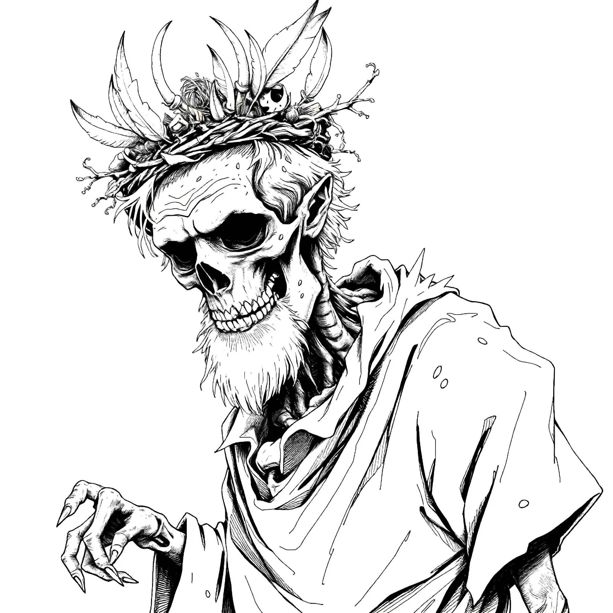

## Into the Woods

The next morning, the hobbits discovered their prize pumpkin was missing. They told [Buford](/hobbity/world/npcs/#buford-niss) about the scarecrow. He didn't know what had animated Hungry Hank, but suspected it was some kind of old magic—the sort of thing best left to someone who understood such matters. He told them about an old hermit who lived deep in the Old Woods, a friend of his who might know more. Buford gave them a bronze coin to guide their way and loaned Turnip a blowgun for the journey. He asked them to bring the old man food.

The party entered the woods and found the Hermit's dwelling—though none of them agreed on what it looked like. Turnip saw a too-tall hobbit-hole. Wedge saw an enormous skull. Boffo saw a drafty old cabin. The Hermit didn't answer the door, and the front room was filled with strange noises and the clatter of odd devices. They climbed a tree and entered through a window on the second floor.

Inside they found the body of [Tobias Chubb](/hobbity/world/npcs/#tobias-chubb)—and their missing pumpkin. The pumpkin thief had met his end in the woods.

The Hermit would not answer their questions or even return their greetings. He only said he was hungry. The hobbits, who were hungry themselves, decided to cook lunch. They made a pumpkin soup from the recovered prize pumpkin, and the Hermit ate with them. Only after he'd eaten did he show them his strange arcane machine.

The machine showed each of them a vision:

- **Boffo** saw a terrible plague decimating the Shires
- **Turnip** saw an immense tidal wave washing over the land
- **Wedge** saw his own flesh rotting away as he walked on in undeath

The bronze coin Buford had given them guided them out of the woods by instinct.

## Return to Gomwick

Following the strange bronze coin’s direction, pushing them northwards by instinct, the three hobbits made their way out of the strange domain of The Hermit of the Woods. As suddenly as it had appeared, the mist vanished, and the crisp autumn air became more familiar and welcoming.

About an hour’s walk, they emerged out of the woods and back at the Old Road, and could see before them the mile or so of farmland that led down the gentle slope towards Nettle’s Pond and the small village of Gomwick on its north shore. Even from there they could hear the distant sounds of the multitudes enjoying the final day of the Harvest Festival.

Their stomachs rumbled. They realized now that they had left all of their food atop the Hermit’s pumpkin table—that which they did not use to make their soup, that is—and had not eaten a single thing for what must have been getting close to three hours!

Seeing the fall sunshine bathe the scene before them, and the vibrant canopy of red, orange and yellow trees of the woods behind them and in the distance, they began to wonder if what they had just experienced happened at all. It seemed somewhat dreamlike, and preposterous now that they really dwelt on it. In fact, as they spoke with each other on the walk out of the woods, and realized that none of their impressions of the Hermit’s house’s exterior were even remotely similar, they considered whether all that happened was real or not.

However, they did remember each of their prophetic visions quite clearly: a plague that would decimate the population, a tidal wave that would drown the land, and undeath, patiently, but certainly, waiting.

The walk to Gomwick was interminable as their thoughts turned from what now lay behind them, to the promise of sustenance before them. They questioned whether or not walking all the way up the slope to Toppo Hill House was urgent enough to deny themselves the simple necessity of a late lunch.

Fortunately, the decision did not need to be made, as they spied Buford’s small carriage parked outside The Happy Hobbit Inn, signifying his presence inside. They entered the Inn, and it took no time to spy the old hobbit holding court at a table in the beergarden in the back. Seeing them arrive, he politely shooed away all the others at his table, and invited them to sit and fill their bellies. However, he dismissed any talk of their mission until they could speak in private.

Once they had satisfied their appetites sufficiently, he paid the barmaid, and called for his carriage to take him home; as well as a wagon to pull them up behind him.

They arrived at Toppo Hill House, and retired to a drawing room where tea, wine, biscuits and cake were brought out to supply the conversation.

With intensity in his eyes, Buford listened to their report of meeting with The Hermit. He answered some of their questions as they came up:

“His name? I do not know it! I don't think even he knows it anymore. I’ve only ever known him as ’The Old Man in the Woods’ or ’The Hermit’, to be honest. I did not think of giving you a different name when I appointed this task to you, because I do not know what name to give otherwise. Since you did not ask, I did not feel I needed to elaborate, and I am truly sorry about that.”

“I met him many decades ago, when I was not much older than you are now. I stumbled upon his house when I was out exploring the woods. I shared what food I had with him, and so he invited me to stay and help him with his strange arcane machine. He asked me a simple question, one that I thought was cryptic and inane, but this caused me to see a vision - a vision I have not been able to unsee despite the many years that have since passed. I cannot speak what I saw in that vision to you, I am sorry. But what I saw changed the course of my life. It compelled me to set out for the coast and live a life at sea, where I had a great many adventures, and made my great fortune. But also where I sacrificed and lost a good deal more…”

“A skeleton? What…?! That’s preposterous! Perhaps he grows hungry - I should see if I can have some food delivered for him to see him through the winter. But dead and walking as a skeleton? He is but a simple old man that lives in a cabin in the woods. A bit eccentric, yes, but he is a hermit. He is one of the tall-folk, and he is very old, so perhaps that is why you were so shocked at his appearance and demeanour. It is my fault that I did not prepare you better. The only foible I can truly ascribe to the man is that he seems to have an insatiable appetite for pumpkin pie, and yet he refuses to come to town and enter into the pie-eating competition!”

“Tobias was a man that was always up to no good. He worked for me once. But then, he’s worked for just about every good gentlehobbit in this part of the shire. As farm labour, household servant, handyman…you name it, he’s done it. We’ve all given him plenty of opportunities to turn his life around, but inevitably he returns to the drink in an evil way, gambles what little coin he’s earned, then becomes violent and hateful and has to be turned away. He is truly unhobbitish. I wonder if he might not have had some goblin or elf somewhere in his ancestry. I do not know how or why he may have met such a terrible end out there in the woods by the Old Man’s cabin, but a few bears, boars, coyotes and other dangerous wild animals are known to sometimes wander those woods, and perhaps it was one of those that gored Tobias, and the Old Man had brought him in to his cabin to try to save him. The idea that the Old Man killed anyone, and then was trying to eat him… well, I think your imagination has run away with you and done several laps of the Shires!”

“I’d like my blowgun back, if you wouldn't mind. It is after all, quite sentimental for me.”

Before Buford could send them on their way, Turnip insisted on performing the ballad he had worked out on the walk through the woods. He had intended it for the storytelling quarter-final, only to return to Gomwick and find the competition had come and gone without him. Undeterred, he prefaced the tale with the disclaimer that any similarities between its characters and real hobbits should be ignored on account of he doesn't want the Shirriff coming after him for slander. Buford and his household proved a captive and delighted audience.

### The Pies of Gomwick Fair

or _How a Timely Tumble Turned the Tables on a Trickster_\
as told by Turnip Bramblebrook

> O hark, good folk of field and dell,\
> and gather near to me,\
> For I shall sing of autumn days\
> beside this old oak tree.\
> When pies were piled like haystacks,\
> and cider steamed the air,\
> And fate crept softly through the tents\
> at the Gomwick Harvest Fair.
>
> My friend had reached the finals\
> in the contest of the pies,\
> Where hobbits bold did strive with forks\
> and a hunger in their eyes.\
> The crowd was loud, the trumpets bright,\
> the tables fit for kings,\
> Yet doom lay hidden in the shade\
> of lesser-spoken things.
>
> For near the cider barrels, friends,\
> there whispered two in spite,\
> One, A. Lardy, a grumbling wretch,\
> whose orchards groaned with blight.\
> Seven years the fruit-crown lost,\
> to Odelay the Fair,\
> And envy gnawed his weary heart\
> like a weasel in its lair.
>
> Now Odelay oft declared with pride\
> the secret of his trees:\
> His children sang among the boughs\
> like a gentle summer breeze.\
> Their voices, sweet as starlight spun,\
> he claimed would bless the fruit,\
> And by their songs the harvest swelled\
> from blossom unto root.
>
> But Lardy scoffed at tales like this\
> with bitter curling lip.\
> "Lies and tricks and dismal tales,\
> a fraudulent fellowship.\
> No magic children, no singing trees,\
> no charms of branch and bough.\
> A cheat he is, and by my scheme\
> I mean to stop him now."
>
> With Lardy stood the Potty lass,\
> who muttered low and sly,\
> She listened to his wicked plan\
> to taint the apple pie.\
> A tincture brewed from parasols\
> of a green and poisonous shade,\
> A drop to sour the tasting feast\
> and see their rival fade.
>
> I heard them speak in voices dark,\
> and fled without a sound,\
> To seek my true companions two\
> who swiftly gathered round.\
> We swore an oath in pumpkin light\
> to guard the feast that day,\
> For pies, like peace and honest hearts,\
> must never be betrayed.
>
> Then through the throngs we stole apart\
> beneath the banners high,\
> While market folk with merry shouts\
> sent coloured leaves awry.\
> I tracked the rascal Chubbins T.,\
> a scoundrel thin and sly,\
> Who bore the fateful flask of doom\
> with gleam of cunning eye.
>
> He ambled toward the bakers' tent\
> all aloof and unperturbed,\
> Intent to spill his venom there\
> before the pies were served.\
> But swift as wind on autumn fields\
> I leapt to block his path,\
> And tumbled hard in feigned misstep\
> to Chubbins' pique and wrath.
>
> Flour burst around us both\
> like winter's early snow,\
> The tent was filled with startled cries,\
> amidst the ovens' glow.\
> And in that swirl my comrade brave\
> with fingers quick and light,\
> Drew out the flask from Chubbins' coat\
> and vanished from his sight.
>
> The villain saw his fortune fled\
> and into panic ran,\
> He bolted through the scattered crowds\
> no more to plot or plan.\
> And Lardy's scheme was soon unveiled,\
> his heart of envy bared,\
> While Odelay won once again\
> at the Gomwick Harvest Fair.
>
> So lift your cups and sing with me\
> of courage in the Shire,\
> Of pies unspoiled, of friendships true,\
> of feasting by the fire.\
> For though the shadows sometimes creep\
> through tents and autumn air,\
> The light holds fast when hobbits stand\
> at the Gomwick Harvest Fair.

At the end of the conversation, he gave each of them a stack of 5 gold coins, and said, “Thank you kindly for having done this task for me. I know it was a heavy thing of me to ask, and it cost you a morning’s enjoyment of the Festival. You are welcome here in my house tonight. In fact, I have already taken the liberty and spoken with Nali Stonecleft, and his grandsons already brought up your belongings, which you will find in your individual guest rooms where you slept last night. Your pony, as well, has been brought up and is enjoying his stay in my stable. I encourage you to go back to the festival and enjoy the final night’s festivities! Then come back and sleep comfortably here. Tomorrow morning we will say our goodbyes, and I will see you well provisioned for your journey back to your homes.”

## The Final Night

The party returned to the festival for the final evening.

Turnip, his ballad already performed to Buford's great delight, spent the evening telling more stories by a campfire to a circle of old-timers who griped about how "Tucker Tallowfoot ate 17 pies to win the trophy back in aught-eight"—"You're wrong! It was aught-six, and it was 21 pies!"—and how the pies were full-sized in those days, not the little ones this Bucko Lunderfella ate this year. The apples these days were mealy and flavourless, and the girls not as pretty as they used to be. At the end of the night, they declared Turnip "a fine fellow, indeed" and felt the future of the Shires was in good hands.

Wedge got into at least three fights with inanimate objects he claimed were looking at him funny. The third saw him plunge his axe into the face of a wooden horse on the carousel, making several children cry and many parents upset. Nali Stonecleft took him aside, steadied his paranoid nerves with moonshine, and kept an eye on him for the rest of the evening.

Boffo returned as a conquering hero, his legend embellished and grown in his absence. He spent the evening embroiled in romantic misunderstandings and comic situations involving both Daisy and Grunela. He was not seen by his friends until breakfast the next morning.

## Farewell to Gomwick

In the morning, Buford treated them to a splendid breakfast, then led them outside to Binny, loaded with their belongings and supplies for the trip home. They would travel the North Road this time, stopping at the Right Way Inn, and arriving home by lunchtime tomorrow.

Buford slipped each of them another gold coin as he shook their hands. He told them to put the strange happenings out of their minds. He would personally get to the bottom of it. It should no longer be a concern for them.

The road home was uneventful, busy with hobbits heading to their respective villages and hamlets. Gomwick receded behind them, its existence largely forgotten until next year's Harvest Festival.
