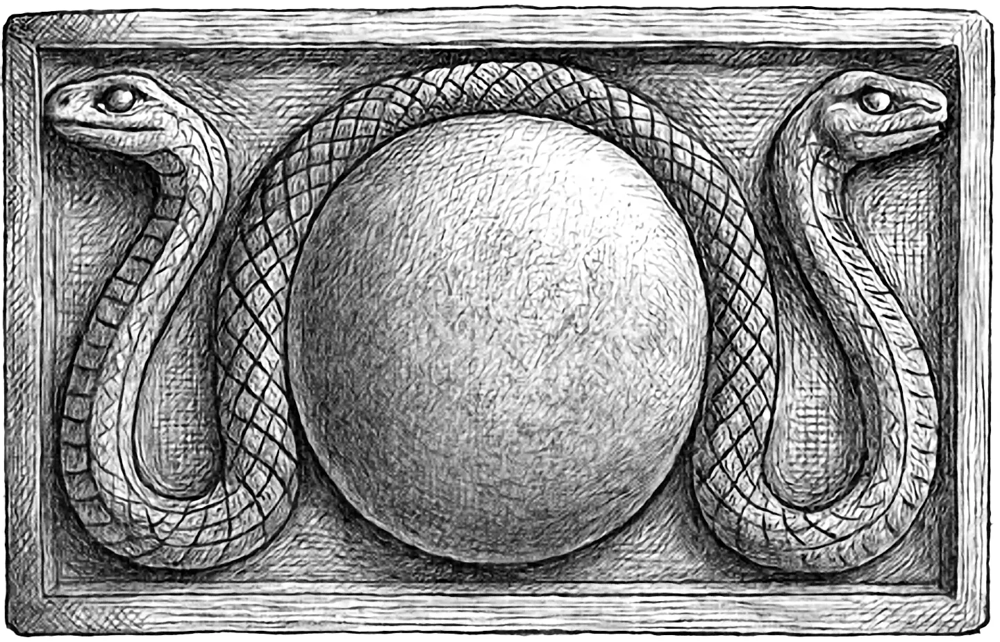

# Green Cows and Blackberries

Session Recap – 27 <dfn title="November">Blotmath</dfn>, S.R. 1425

- **PCs:**
  - [Boffo Lunderbunk](/hobbity/appendix/pcs/boffo) - Level 1 Hobbit Adventurer
  - [Wedge Wedgerton](/hobbity/appendix/pcs/wedge) - Level 1 Hobbit Adventurer
  - [Turnip Bramblebrook](/hobbity/appendix/pcs/turnip) - Level 1 Hobbit Adventurer
- **Location:** [Huddle Farm](/hobbity/appendix/places/#huddle-farm), near Sunnyside crossroads

## Arrival at Huddle Farm

The three hobbits reached Huddle Farm on the road to [Orlane](/hobbity/appendix/places/#orlane) and found themselves hired before they'd even unpacked. [Tom Huddle](/hobbity/appendix/npcs/#tom-huddle), haggard and sleepless, offered 30 gold plus room and board to catch his neighbor [Norrie Sutton](/hobbity/appendix/npcs/#norrie-sutton) red-handed. The feud was straightforward enough: Norrie had thrown up a hedge blocking Tom's right-of-way through Deadman's Gap to the blackberry bushes, and Tom was convinced the retaliation had escalated—a kidnapped dog, a trampled garden, stolen wine, a burned barn, and, most bafflingly, cows painted green. Tom's one condition: the Suttons must not see them.

## The Huddle Household

[Primula Huddle](/hobbity/appendix/npcs/#primula-huddle) greeted the party with the strained patience of a woman managing eight children, a ninth on the way, a freeloading dwarf named [Krund Pothrower](/hobbity/appendix/npcs/#krund-pothrower), and now three more mouths at her table. The twins Motto and Otto carried the farm work. Berry sang. Sherry buried herself in books and insisted the house was haunted, a claim her siblings dismissed. Sara and Mary bickered without pause. Young Bordo swore he'd seen a frog-headed demon at the ruined tower nearby, and baby Marlo contributed nothing but noise. The party poked around the Fortfield ruins for half an hour and took a brief tour of the house—enough to get their bearings, not much more. One thing caught the eye: some of the stones Tom had repurposed from the ruins for his excavation were carved with serpent motifs. Not hobbit work, and not recent.

## First Impressions

Turnip made himself memorable early, first by frightening Bordo and then by suggesting to Tom that his wife and children might come to bodily harm from the saboteur. This did not calm the farmer. Tom, already wound tight as a bowstring, edged closer to something brittle. Wedge and Boffo took stock of the situation quietly. The job seemed simple—a neighbor dispute, some petty vandalism—but the household felt like a pot about to boil over with or without Norrie Sutton's help.

## Conclusion

The party settled in at Huddle Farm with a paying job and a long list of grievances to investigate, but the night's work had yet to begin.
