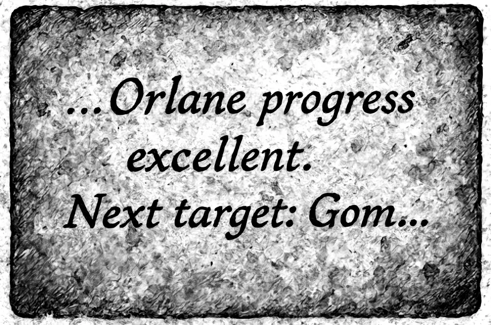
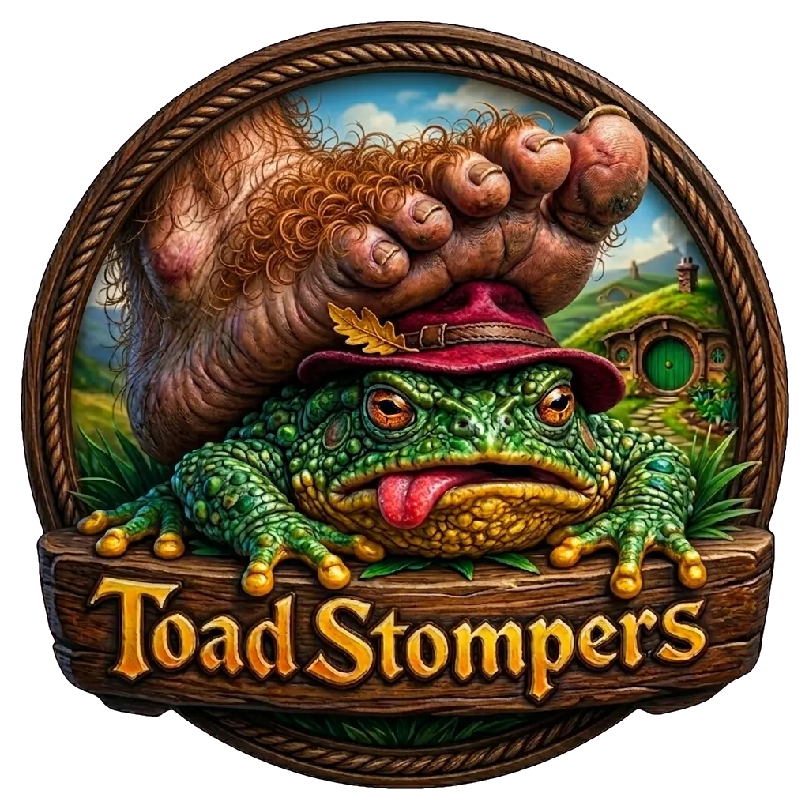

## The Bridge

After a long winter's rest, the three hobbits set out again on the road to Orlane. They hadn't gone far before trouble found them—a band of goblins had claimed a bridge ahead and weren't inclined to share it. The fight was sharp and quick, but a goblin arrow caught Turnip square in the chest and put him down. Boffo and Wedge drove the goblins back and got Turnip breathing again, though the wound ran deep. The arrow had pierced his lung, and no amount of rest would fully mend it.

On one of the slain goblins the party found a note referencing Orlane as a current target and [Gomwick](/hobbity/appendix/places/#gomwick) as the next—confirming an organized operation expanding outward.

The goblins were scattering when a giant toad burst from beneath the bridge. It might have turned the fight ugly, but Turnip—barely on his feet—put a sleep dart into the thing before it could do real damage. The toad slumped mid-lunge, and the party finished it off. Turnip later grumbled that the toad had been eating goblins and probably deserved better than a stomping. The others were less sentimental. The name "Toad Stompers" stuck all the same.

## Conclusion

The bridge was clear and the road to Orlane open, though Turnip paid a lasting price for the crossing.
