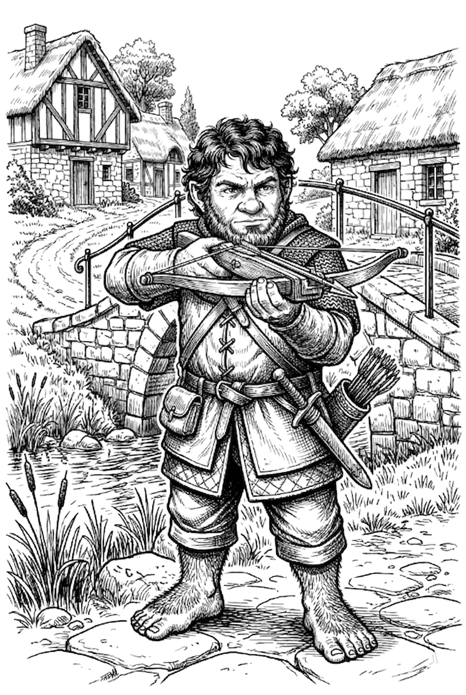

## The Road to Orlane

The road south was quiet until it wasn't. A pack of dire wolves crouched over a carcass ahead, blocking the way. Wedge acted fast—he cast Light into the eyes of the nearest wolf, blinding it. The three hobbits ran. No one looked back long enough to regret it. Boffo briefly considered purifying the wolves' meal out of spite, but his legs made the decision for him.

## Orlane

Orlane sat on a flat plain, a hobbit village surrounded by farmland and split by a river. The party found [Constable Grover](/hobbity/appendix/npcs/#constable-grover) on the porch of the Constabulary, flanked by his deputies [Donovan](/hobbity/appendix/npcs/#donovan) and [Bulbar](/hobbity/appendix/npcs/#bulbar), repairing a crossbow. He wore mail armor—a detail that raised hobbit eyebrows, though the three travelers conveniently ignored their own leather. Grover greeted them well enough, answered their questions about the village, and told them to stay out of trouble. They reported the dire wolves on the road and he noted it.

Following [Buford](/hobbity/appendix/npcs/#buford-niss)'s advice, they headed first to the Golden Grain Inn to find [Bertram](/hobbity/appendix/npcs/#bertram). The place was decidedly unhobbity—cold and dark. Bertram served them a stew that smelled wrong and tasted worse. When they asked the cook what kind of stew it was, he replied simply: "Meat." Boffo had every reason to cast Purify Food & Water. The spell was practically screaming to be used. Instead, Boffo cleaned his bowl, looked up, and said, "I'll have two bowls please." The stew required a save against poison. They all survived, but the Golden Grain left a bad taste in more ways than one.

They took rooms instead at the Slumbering Serpent Inn, kept by [Belba](/hobbity/appendix/npcs/#belba) and [Olwyn](/hobbity/appendix/npcs/#olwyn). Wedge was uneasy. Something about the folk on Bertram's side of the river sat wrong—too quiet, too strange. Turnip kept his eyes open and his opinions close. Orlane was hospitable enough on the surface, but the surface was thin.

## Conclusion

The party reached Orlane intact and settled in, but the village already feels wrong. Whatever brought them here, it won't be as simple as dire wolves on the road.
