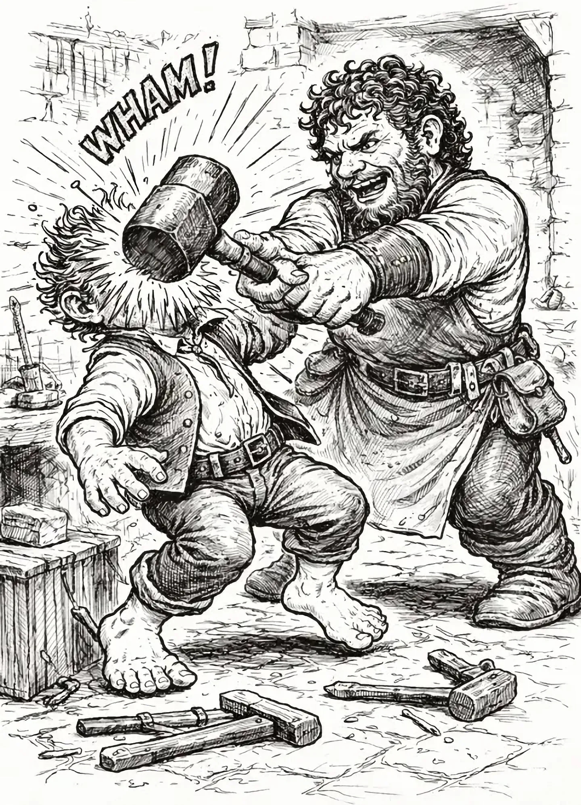
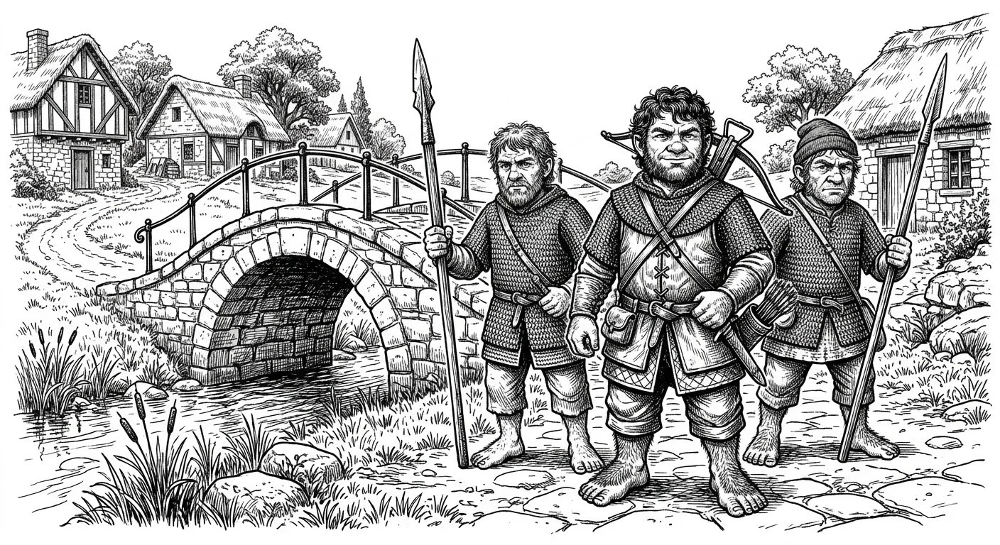
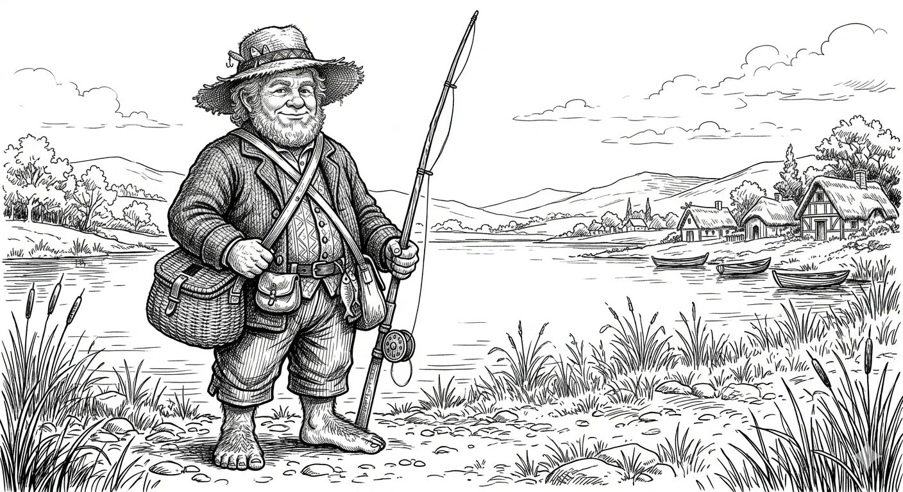

## The Blacksmith and the Constable

With [Constable Grover](/hobbity/appendix/npcs/#constable-grover) out searching for the dire wolves the party had reported, the three hobbits paid a visit to [Mattie Snowvale](/hobbity/appendix/npcs/#mattie-snowvale), the blacksmith. He swung on them without a word, catching Wedge across the skull with a hammer and put him on the floor. The blow left a dent that no amount of healing would fill—something in Wedge's bearing, his way with folk, was knocked loose and would not settle back.

Turnip dropped the smith with a sleep dart before he could do worse. Maddie, Mattie's wife, furious, stormed off to lodge a complaint. The whole affair left Wedge hurt and angry.

Outside, Boffo looked at the other two. "Well," he said, "do you want to continue our stroll around Orlane?"

They did.

The party tried the Temple of Merikka and was turned away at the door. They visited the Elm Grove—a squat stone cottage half-sunk into the earth, apparently empty. A weasel darted through the weeds outside. Wedge pulled out his whistle to call it over, but instead of the weasel, a raven dropped out of the sky and landed on his arm, which seemed a little queer. They left the place alone. Down by the river they found [Vilma](/hobbity/appendix/npcs/#vilma), a widow, but [Rolo](/hobbity/appendix/npcs/#rolo)—son of Atticus—came out with a crossbow, put a bolt at their feet, and told them to move along. He then walked to the temple and knocked.

## Prowling After Dark

That evening the party sat on the porch of the Slumbering Serpent eating supper when Grover appeared. He said nothing about the blacksmith. Instead he told them his men found no dire wolves. Grover told them to wrap up their business and get out of Orlane. The party shrugged it off.

Night fell and the hobbits went creeping through backyards. [Zacharias](/hobbity/appendix/npcs/#zacharias) was out fishing, so they let themselves into his home—not breaking in, mind you, but simply doing the polite thing and waiting inside. Any decent hobbit would do the same. They lit every lantern and the fireplace, put a kettle on, and made themselves thoroughly comfortable.

It occurred to them, after a second cup, that they ought to search the house in case Zacharias was home after all and simply hadn't heard them. This was, of course, perfectly reasonable. What was less reasonable was the collection of statues scattered about the place—stone figures that had been doing an admirable job of being furniture right up until they weren't. The statues lurched to life mid-search, and the Toad Stompers departed with a speed that would have impressed even Constable Grover. They left the lanterns burning, the fire crackling, the kettle whistling, and the front door standing wide open to the night air. Hospitality, as it turned out, had its limits.

From there they skulked behind the smithy and forced their way into the ruins of the Foaming Mug Inn. The place had been torn apart, furniture smashed, walls gouged. In the basement they found a nest: three sleeping pallets, two troglodytes. The fight was brief and ugly. One of them raked its claws through Turnip's side before the hobbits put it down. The wound looked manageable at first, but the flesh around it went hot and angry by morning—troglodyte filth working its way in. Whatever healing the others could manage closed the skin but couldn't undo what the fever took. Turnip would feel that one for the rest of his life.

## Caught at the Bridge

At dawn, three hobbits emerged from the shattered doorway of an abandoned inn—filthy, bloodied, and smelling faintly of troglodyte—and walked straight into Constable Grover and his deputies, standing at the foot of the bridge outside Mattie Snowvale's smithy. Even a charitable observer would have found the scene suspicious.

Grover was unimpressed with their explanations. He sent Deputy [Donovan](/hobbity/appendix/npcs/#donovan) to investigate their claim about troglodytes in the basement, but as for the three hobbits themselves, he would be escorting them back to the Slumbering Serpent. Now.

Turnip would not have it. The very idea—a hobbit constable marching fellow hobbits through the streets like common criminals—was, in his view, downright un-hobbit-like, and he said so. Grover's expression suggested he disagreed. He and his deputy raised their crossbows. Turnip kept talking. Grover told him, plainly and without affection, to stop talking or he would shoot. Turnip did not stop talking. It was simply inconceivable to him that one hobbit could loose a bolt at another. Hobbits didn't do that. It wasn't done.

It was about to be done. Wedge, who possessed a keener sense of self-preservation and had already been hit by one weapon that morning, stepped forward and begged Grover not to shoot his friend. The constable lowered his crossbow—and then cracked Turnip across the skull with the butt of it. Turnip dropped like a sack of turnips, which settled the argument nicely.

Boffo, for his part, had been paying very little attention to any of this. It was an uncommonly fine spring morning—the kind where the light comes in low and golden over the river—and he had been enjoying it.

## Grover's Reckoning

The constabulary in [Orlane](/hobbity/appendix/places/#orlane) was purpose-built in the way that hobbit constabularies are purpose-built, which is to say it had been there since anyone could remember and no one had ever taken it seriously. The constable's post was a one-year volunteer term that usually fell on some hapless young hobbit who spent twelve months listening to farmers bicker about foxes and stolen chickens. The jail was a couch. The bonds were a length of rope tied to a table leg. Turnip sat on the couch and considered his situation.

Grover came back with a piece of cake. "You may as well eat some breakfast," he said. "Maybe that'll settle you."

"Thank you," Turnip said, because he was not so rude as to refuse breakfast. "But I must say this has all gone terribly wrong. You're not acting like a constable. You're acting like you have a boss. Someone you answer to."

Grover looked at him with utter confusion. "Someone I answer to? I answer to the townsfolk of Orlane, my friend."

Turnip chewed his cake and said nothing, which was unusual for Turnip.

Then Donovan returned and confirmed the story: two dead troglodytes in the basement of the Foaming Mug. The colour drained from Grover's face. He went quiet and pensive for a long moment. Then he untied the rope.

"Go back to the Slumbering Serpent," Grover said. "Get yourself a proper meal and some rest. I'll be by to talk to you and your friends."

Turnip stood, brushed himself off, and waited.

"Well?" Grover said.

"I'm waiting for the apology. It's customary for someone to apologize to the wronged party."

"Off you go."

"Sorry for the inconvenience, something like that."

"Off you go."

"Well, I never," Turnip said, and humphed his way out the door.

## Belba Takes Charge

At the Slumbering Serpent, Boffo and Wedge told [Belba](/hobbity/appendix/npcs/#belba) everything in her private parlor—the troglodytes, the violence at the Foaming Mug, the growing strangeness in Orlane. The news shook her. She sent her husband [Olwyn](/hobbity/appendix/npcs/#olwyn) to collect Turnip and track down Grover. Between Belba's persistence and Olwyn's quiet diplomacy, Grover washed his hands of the three hobbits entirely. They were now "Belba's problem." Deputy [Bulbar](/hobbity/appendix/npcs/#bulbar) delivered a note later: "Stay out of trouble."

## Zacharias

Olwyn confirmed that Zacharias had returned from fishing. The old hobbit took the party's letter—the one he himself had written to [Buford](/hobbity/appendix/npcs/#buford-niss)—tore it up, and pocketed the pieces. Paranoid about being overheard, he led them to the lakeshore to talk freely.

 His intelligence was grim: people were disappearing and coming back changed. He named four he believed compromised—storekeeper Wilbur Oldbuck, blacksmith Maddie Snowvale and her family, and carpenter Quinn Finla. The temple priests were the source. Problems started about a year ago when two priests arrived from the coast. Zacharias trusted Grover but said the constable needed proof before he could act.

## Arming Up

Zacharias opened his stores. He handed over a Potion of Healing with two doses, a Potion of Speed, scrolls of Sleep, Wizard Lock, and Dispel Magic, six special sling bullets, and a hundred gold coins to pose as payment for temple healing. He offered a Cloak of Elvenkind; the party declined and left it with him. They divided the gear among themselves. Wedge, for his part, revealed an ESP scroll he'd been sitting on since the wizard's tower at [Huddle Farm](/hobbity/appendix/places/#huddle-farm).

That night, around ten, the three hobbits walked to the temple. They posed as pilgrims seeking healing. Boffo showed his wounds from the troglodyte fights—real enough to sell the story. The temple received them.

## Conclusion

The party turned a morning in hobbit jail into an evening at the temple door, armed with Zacharias's gifts and a thin cover story. Whatever the priests are hiding, the hobbits walked straight into it.

### Enemies Defeated

- 2 troglodytes

### Treasure

- Potion of Healing (two doses)
- Potion of Speed
- Scroll of Sleep
- Scroll of Wizard Lock
- Scroll of Dispel Magic
- 6 special sling bullets (4x +1, 1x Sleep, 1x Phantasmal Force)
- 100 gold coins (for temple entry)
