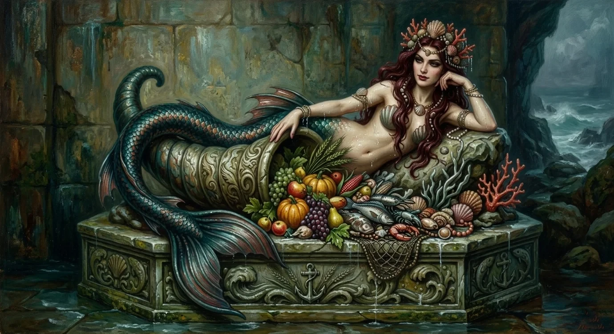
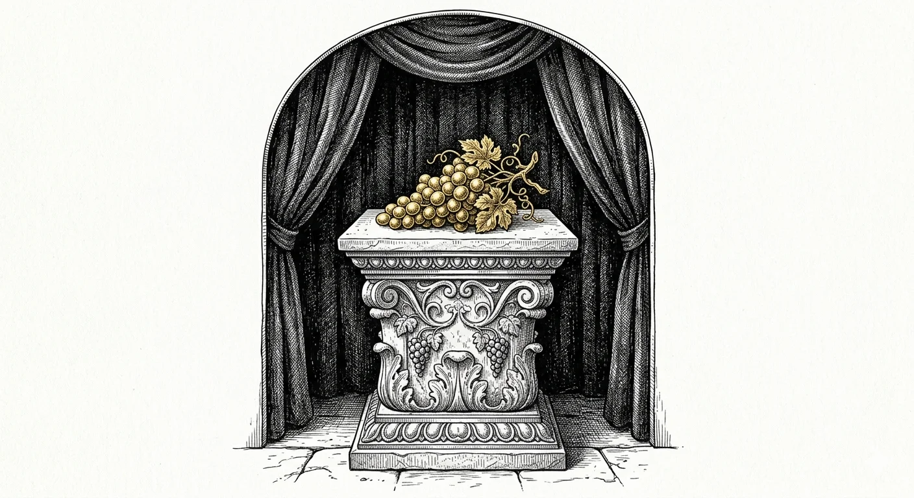
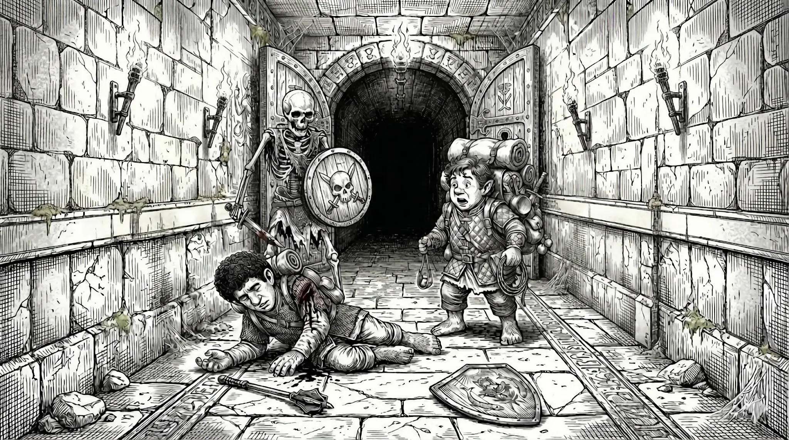

# The Skeleton Room

Session Recap – <dfn title="March 22, 2026">22 Rethe, S.R. 1426</dfn>

- **PCs:**
  - [Boffo Lunderbunk](/hobbity/appendix/pcs/boffo) - Level 1 Hobbit Adventurer
  - [Wedge Wedgerton](/hobbity/appendix/pcs/wedge) - Level 1 Hobbit Adventurer
  - [Turnip Bramblebrook](/hobbity/appendix/pcs/turnip) - Level 1 Hobbit Adventurer
- **Location:** Dungeon beneath the Temple of Merikka and temple ground floor, [Orlane](/hobbity/appendix/places/#orlane)

## Cleaning Up the Lair

Now it must be said that Boffo Lunderbunk was, at this particular moment, not at all hobbit-sized, and had not been for some hours. The potion he had drunk in the troglodyte tunnels had stretched him to twice his proper height, so that he filled the passageways like a cork in a bottle and had to stoop and shuffle and mind his head at every turning. It was uncomfortable, and Boffo had begun to suspect that anyone taller than a hobbit must live in a state of constant misery.

The three companions picked through the caves beyond the troglodyte lair. Two rooms, mud-floored and stinking, with doors set into rough frames. One had a bar that locked from the outside. A cell. Empty, but ready. No hobbit prints in the mud—only troglodyte claws.

"They wanted us alive," Boffo said, looking at the bar. "Whatever they had planned for us was worse than dying."

## The Lost Goblins

Wedge heard them first. Whispers in the dark, echoing off wet stone so you couldn't tell which direction they came from. Two voices, bickering: "I told you it was this way." "No, no, this way, up here." And then, panicking: "We're lost."

He crept forward with the lantern, which rather defeated the purpose of creeping. Two goblins were crouched in a corner. They'd been waiting, and they saw the light before Wedge saw them. One swung a club. It missed, clanging off the wall.

Boffo, who had to crouch double to fit through the passage, brought his mace around in a backswing. He caught the goblin between the eyes and the mace went clean through, more or less to the chest. Where the head had been there was now something resembling ground beef. The other goblin looked at this, looked up at the hobbit filling the tunnel, and a puddle of piss spread beneath him on the stone.

"Are you a goblin?" Boffo asked, hiding the dripping mace behind his back.

His name was Four. Just Four. He'd been sent by "the scarred one" to find the hobbits and report back, but he was lost and couldn't count past his own fingers.

"He's going to be a liability," Wedge said. "He's going to make noise. He's going to alert people. Manacle him to a sconce and leave him."

"Well, what do you mean a liability?" Turnip asked.

"He's a constant liability," Wedge said. "He's not going to be a help."

So they manacled Four to a torch sconce and shut the door. Before it had fully closed, Four's voice came echoing down the passage: "Help! Help! Help! Help!"

"Looks like Wedge was exactly right," Boffo said.

## The Second Goblin Fight

They opened the wrong door. Or the right door, depending on your perspective.

"It's them. Let's do it."

Four goblins in the dark, one clutching a net. The net-goblin stepped up, ready to throw, and then got his first good look at Boffo—six feet of hobbit crammed into a five-foot ceiling, chainmail glinting, mace still wet—and simply fumbled the net and scrambled backward.

The fight was short and ugly. A goblin threw the net over Turnip, tangling him properly, and for a moment things looked grim. But Turnip had a trick. He could, by some small magic, untangle any knot or rope with a single pull, and the net fell away from him like water. Boffo brought his mace down on the net-goblin and the thing simply ceased to exist. The last one alive dropped its club and ran.

"Guys," Boffo said, looking at his mace in amazement, "I think I'm finally getting the hang of this tall fellow thing."

## Boffo Shrinks

It happened on the ladder. Boffo was climbing up through the shaft toward the temple when the magic let go—_bloop bloop bloop_—and he was three feet tall again, his chainmail settling around him like a blanket on a child. It was a mercy: had the potion lasted another minute he'd have been wedged in the shaft like a stopper.

"I liked giant Boffo," Wedge said, watching him shrink. "I was hoping he'd stay that size."

Boffo looked down at his hands. "I'm relieved," he said. And then, more quietly: "I wouldn't have known if it was permanent."

He offered the Brooch of Shielding to Wedge. Wedge shook his head. "You're still the frontline guy."

"Then let me go first," Boffo said, and for once, they did.

## Return to the Temple

Back on the ground floor, the torches had gone out. Everything else was as they'd left it—[Misha](/hobbity/appendix/npcs/#misha)'s bedroom, the offering hallway with its alcoves of golden food, the worship hall beyond. But as Wedge walked through the door, he heard voices from the sanctuary.

## The Snowvale Cult

Four hobbits stood in the sanctuary. Griff, broad and furious. His son Timba beside him, fists up. And [Kaylin](/hobbity/appendix/npcs/#kaylin-snowvale), daughter of [Maddie Snowvale](/hobbity/appendix/npcs/#maddie-snowvale), the blacksmith's wife who had filed that complaint with the constable. Behind them stood Misha, the false priestess, murmuring: "Remember. Don't harm them."

"Say it ain't so, Misha," Boffo said. He wanted to believe it wasn't what it looked like. He always wanted to believe.

Wedge had no such hesitation. "Let's subdue them and get answers."

It was ugly, fighting unarmed hobbits. The party pulled their blows as best they could. Turnip threw a net over Griff—put to good use already. Boffo waded in with the flat of his mace. But during the scuffle, Kaylin slipped through the west door. Misha vanished with her. [Derek Desleigh](/hobbity/appendix/npcs/#derek-desleigh), who was somewhere in the building, never showed his face.

They manacled Griff and Timba back to back on the floor. Boffo tried talking to them. "Why? Why did you let this cult into your town?"

Griff clenched his jaw and stared at the wall. Timba looked Boffo in the eye and spat.

"We're wasting time," Wedge said.

## The Mural of Merikka

They searched what remained. A corridor of monks' cells—small rooms with reed mats, three of them slept in, one pristine. A dining hall with a mural of Merikka in fresh paint on the north wall: the goddess surrounded by harvest bounty—cornucopia, fish, pumpkins, grapes.

 Display cases along the walls held specimens under glass: a carrot, an ear of corn, wheat stalks, a bottle of wine. A shrine to abundance in a town where people were disappearing.

## The Golden Offerings

Nine alcoves in the hallway, nine gold replicas of food. Wheat, potato, oats, corn, carrot, turnips, grapes, barley, beans. Each one rendered with precision—imperfections and flecks of dirt cast in gold.

Boffo reached for the potato.

The world went away. He was underwater, in a place of beauty, and something was swimming toward him. Merikka. She took his face in her hands, green and cool, and pressed her lips to his. Something pulled at his will, tried to take root in his mind, but Boffo held, the way he always held—not out of will, but because he simply didn't know how to stop being himself.

He was back in the hallway, soaking wet, the golden potato in his hands.

"Turnip," he said, dripping onto the stone floor, "you weren't lying."

He set his frying pan on the empty pedestal. It seemed only fair to leave something in exchange. A hobbit's propriety, even in a cult's temple.

## The Bones Stand Up

"Well, there's no doubt now, guys," Wedge said. "There's definitely an evil cult going on. There's skeletons and everything."

They were in a bare room at the south end of the temple. Wooden benches. A carpet down the middle. And on the floor, what Boffo had taken for old bones.

The bones stood up.

Eight of them, each with a short sword and shield, forming into two shield walls with a discipline no goblin had ever shown. They came at Turnip first—three blades finding him before anyone could react. Steel bit into him, once, twice, and he staggered.

The party fell back to the doorway. Wedge slung stones from the rear, lobbing them past his friends' heads. Boffo's mace sang. Every time it connected, a skeleton burst apart into bone dust and silence. But there were eight, and the hobbits were tired, and luck was not with them.

Turnip's brooch took blow after blow, absorbing what would have killed him twice over. Then it cracked, and shattered, and the next sword stroke put him on the floor. He lay still, blood pooling beneath him on the cold stone.

Wedge scrambled to him with the last healing potion—and poured it between Turnip's teeth. Turnip gasped and opened his eyes, diminished. Something had been taken from him in the dying, something that would not come back.

Two skeletons remained. They turned from the fallen hobbit to the one still standing.

"Is this where Boffo perishes?" Boffo said, and he said it lightly, the way you say a thing to keep it from being true.

The skeleton's sword drove through the gap between his shield and chainmail, burying itself to the hilt. Boffo went down. His mace clattered on the stone beside him. The mace that had broken every skull and shattered every bone they'd put in front of him. It lay there, useless, while Boffo's blood ran into the cracks between the flagstones.

Turnip, barely standing and running on sheer hobbit spite, put a sling stone through the last skeleton's ribcage.

Then silence.

Boffo lay on the floor of the skeleton room, and he was dying, and there was nothing left. No potions. No healing. No magic. The brooch was dust. The hobbit touches were spent. Wedge knelt beside him and there was nothing in his hands that could help.

Somewhere in this temple—fled through a western door, vanished into the night—there was a priestess who could heal. Whether she was friend or fraud or something worse, and whether two battered hobbits could find her before Boffo bled out on the cold stone, was a question none of them could answer.

## Conclusion

The party cleared the troglodyte lair, fought through goblins and undead, and confronted cultists in the temple above. They end battered and out of resources, with Boffo bleeding out on the floor.

### Enemies Defeated

- 6 goblins (4 killed, 1 subdued, 1 fled)
- 8 skeletons
- [Griff Snowvale](/hobbity/appendix/npcs/#griff-snowvale-gardner) (subdued)
- [Timba Snowvale](/hobbity/appendix/npcs/#timba-snowvale-gardner) (subdued)

### Treasure

- Golden potato (from offering alcove)
