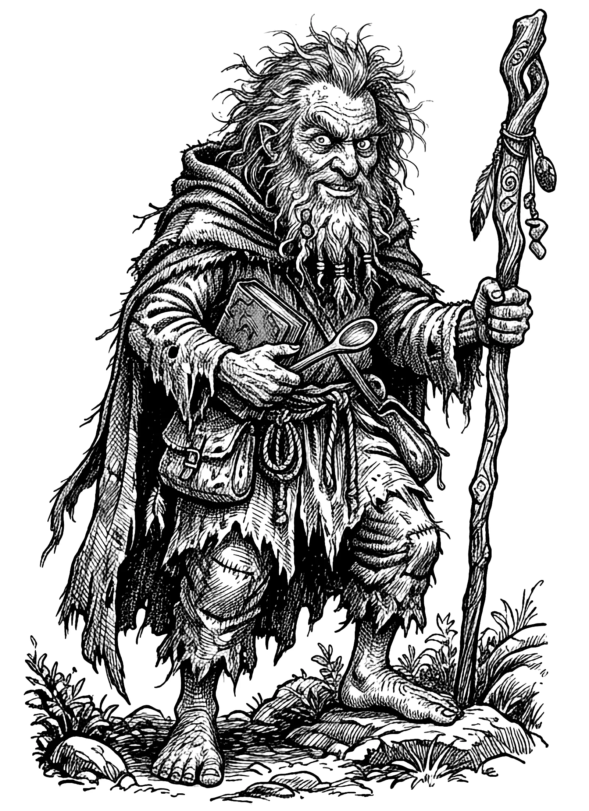
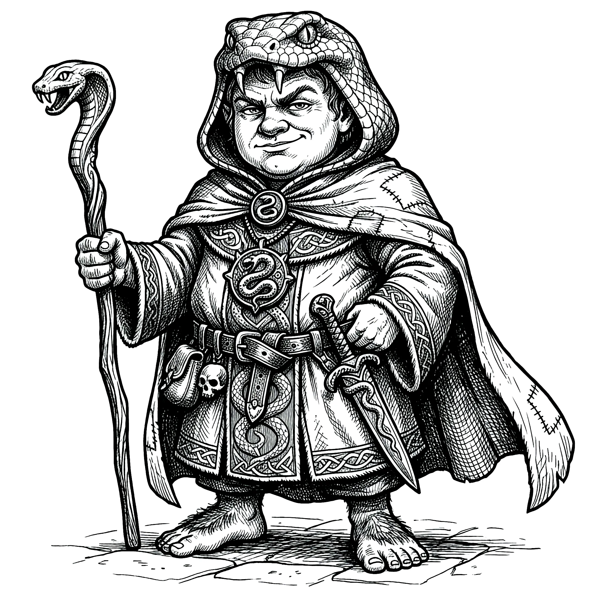
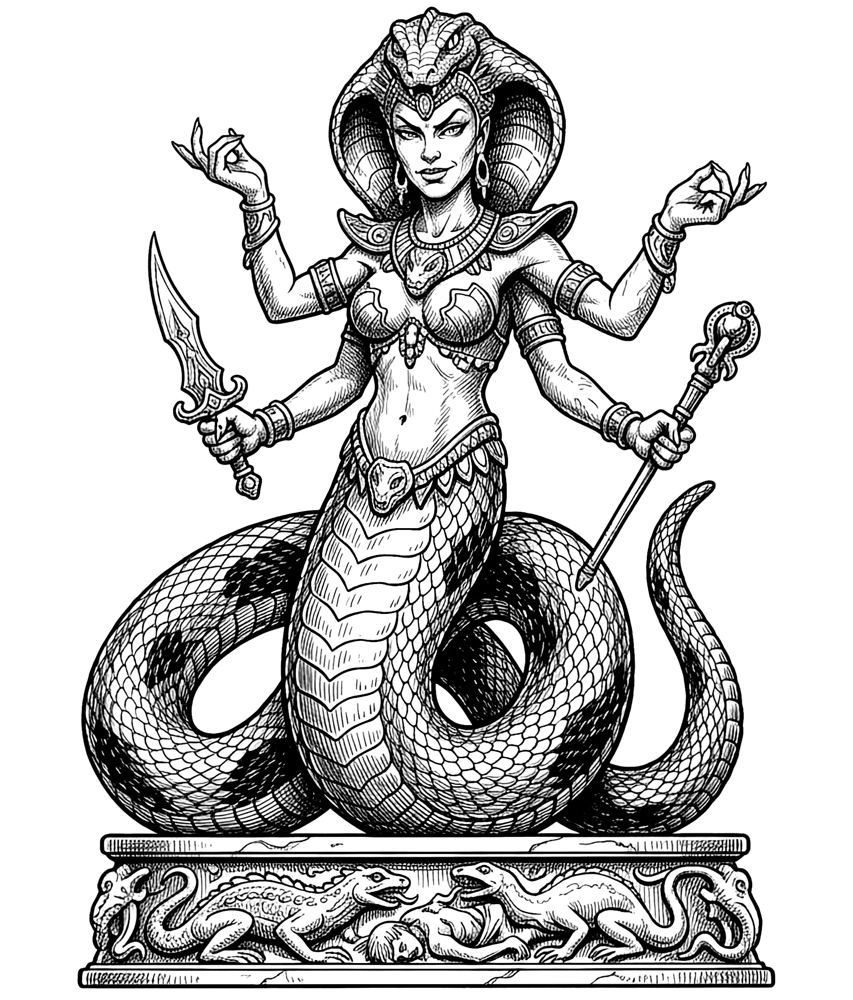

# The Serpent Beneath

Session Recap – 31 <dfn title="March">Rethe</dfn>, S.R. 1426

- **PCs:**
  - [Boffo Lunderbunk](/hobbity/appendix/pcs/boffo) - Level 1 → Level 2 Hobbit Adventurer
  - [Wedge Wedgerton](/hobbity/appendix/pcs/wedge) - Level 1 → Level 2 Hobbit Adventurer
  - [Turnip Bramblebrook](/hobbity/appendix/pcs/turnip) - Level 1 → Level 2 Hobbit Adventurer
- **Location:** Dungeon beneath the Temple of Merikka and [Orlane](/hobbity/appendix/places/#orlane)

## Not Dead Yet

Boffo Lunderbunk was not dead. This came as a surprise to everyone, Boffo included. The skeleton's sword had gone through the gap in his chainmail like a letter through a slot, and by all rights he should have stayed down on the cold stone floor of that terrible room. But hobbits are stubborn creatures, and Boffo's companions were stubborner still—they dragged him back from the edge by sheer will and hobbit touches and whatever thin thread of luck the three of them had left. He'd lost something in the dying, though. The skeleton's sword had caught him in the shoulder joint, and the wound would heal crooked. That arm would never move quite the way it used to.

The party was about to flee the dungeon—beat half to death, out of potions, running on lantern fumes—when they rounded a corner and nearly collided with an old hobbit coming down the stairs.

## Ramne

He carried a book in one hand and a wooden spoon in the other, and a weasel sat on his head like a furry hat. His name was [Ramne](/hobbity/appendix/npcs/#ramne), and he'd been looking for them. The weasel's name was Twitch. "Well now we know why she didn't come to the whistle," Boffo said. Wedge nodded. "She's already got a friend."

He healed all three of them with a touch, which was the second time in one evening that divine magic had been worked on hobbits who, until very recently, hadn't known such things existed. The old hobbit moved at the speed of an arthritic tortoise and had the combat utility of a wooden spoon, which he also carried. But he knew things. He'd been living in that half-buried stone cottage west of the Slumbering Serpent, watching the village come apart at the seams. People taken to the Golden Grain, emerging weeks later with empty eyes and rehearsed smiles. Ramne didn't trust [Zacharias](/hobbity/appendix/npcs/#zacharias). He didn't trust anyone, really, possibly including himself—"There's not a single person in this village who's telling the truth," he said. "Maybe not even myself."

He was a druid of sorts, though he'd deny the word. The only religion he followed, he said, was his pipe and a bit of pipeweed. His spells were useless underground—animal friendship, speak with animals, locate plant. But he had three castings of Cure Light Wounds, and he spent all of them on the party. Twitch, for her part, would prove considerably more useful than her master.

Reinforced and unwilling to leave the job half done, the Toad Stompers pressed deeper into the temple.

## The Lower Temple

A long room flanked by pews, a carpet running down the centre. This was where the skeletons had risen from—the bones still scattered across the floor where they'd fallen.

The hobbits caught Ramne up on everything—the troglodytes, the goblins, the priestess, the dead body in the crawlspace. Ramne sat down on a bench and had a long think. Boffo, meanwhile, stomped skeleton skulls against the wall, one after another, half out of revenge and half because it felt right.

"Religion don't usually go around where we're from," Boffo said, watching Ramne pack his pipe.

"The only religion I follow is this right here," Ramne said, and lit it.

"Can I have a bit of that religion too?"

While Turnip pondered whether they could roll up the carpet and carry it out of the dungeon, he discovered the trapdoor beneath it—the one the goblins had used to move between levels, its edges scuffed from regular use.

Two doors led south. One opened onto a small chamber with a table, two comfortable chairs, an unopened bottle of wine, and two clean glasses. A civilized room in an uncivilized place. The other opened onto something considerably less civilized.

## The Torture Chamber

The smell of fresh wood and oil. A rack. A table with heavy leather straps. A hobbit-sized Iron Maiden in the corner. Pine boxes stacked along the walls—some were packing crates for the equipment, some were coffins. All of it was brand new. None of it had been used. Not yet.

"The same hammer that went into your skull, Wedge," Boffo said, looking at the iron work, "is the same hammer that made this."

## The Goblin Barracks

Beyond the torture chamber, the stink hit them. A meeting room with smashed furniture, straw pallets along the walls, and a pile of goblin excrement in the corner. A sliding panel in the north wall gave a view into the skeleton room—a spy hole. The goblins had been watching.

Eight pallets. The hobbits counted on their fingers: six goblins killed, one fled with Derek, one chained in the basement crying for help. Eight for eight. No more goblins, then. Probably.

## The Bell Trap

The door at the south end of the barracks was locked. Wedge picked it clean. Turnip pressed his ear to the wood and heard voices. Faint, conversational. Not alarmed.

They opened the door. A string of bells erupted into jangling chaos on the other side, rigged across the corridor at knee height. So much for stealth.

Beyond the bells, the walls had gone mad. Every surface was covered in writing—scratched into stone, painted in excrement, in blood, in charcoal. Insane ramblings about great coils that would envelop the world, about scales counted into the hundreds, about plagues that would cleanse the land and bring her light back into this forsaken dark world. Love letters to something with a serpent's body. Prayers to something called Explictica.

"The crows are scared because the serpent hungers," Boffo said quietly. "That's what [the Hermit](/hobbity/appendix/npcs/#the-hermit) said."

## The Serpent's Lair

They came around the last corner of the winding passage and a voice shouted, "Now!"

A goblin crouched at the junction, club raised. Behind it, [Kaylin Snowvale](/hobbity/appendix/npcs/#kaylin-snowvale)—the blacksmith's daughter—hid behind hay bales with her fists up. In the far corner, [Misha](/hobbity/appendix/npcs/#misha) waited, doing something none of them could see. And behind a desk, in robes and fancy chainmail with a cobra-headed mace in his hand and a snake in a cage at his elbow, stood the architect of all of it.

[Abramo](/hobbity/appendix/npcs/#abramo). The serpent's priest.

Wedge scrambled onto the hay bales. Boffo squared up against the goblin and whiffed. Turnip fired his blowgun at Abramo and the dart pinged off stone. Fortune, it seemed, had abandoned them.

Abramo released the snake from its cage. Twitch the weasel streaked across the floor and tore it apart in a spray of blood and thrashing coils, "Weasel beats snake!" Wedge called from the hay bales, vindicated at last.

Abramo hissed something in a language that wasn't meant for hobbit ears, and a wave of cold terror washed over Boffo. Boffo, who had died and come back not even an hour ago, shrugged it off. The goblin's club found the gap in Boffo's guard and cracked against his ribs hard enough to nearly put him back on the floor. Ramne, still shuffling through the corridor at glacial speed, arrived just in time to press a healing potion into Boffo's hands.

Wedge leapt down from the hay bales onto Kaylin Snowvale, who had fallen prone. He cracked her across the face with the butt of his spear, trying not to kill her. Bone crunched. Blood poured from her broken nose. She didn't stop. There was nothing behind her eyes to reason with.

Abramo cast Blight—a withering curse that settled over the party like a fog. Wedge and Turnip felt their limbs go heavy, their aim worse, their reactions dulled.

Wedge drew himself up on the hay bales. "Your feeble attempt to command the darkness will get you nowhere," he announced. "Time for you to see the light!" He cast Light at Abramo with a flourish. Abramo shook it off without blinking. "Son of a bitch," muttered Wedge.

Turnip reloaded his blowgun, steadied his breath, and found his mark. The dart caught Misha in the neck. She slumped unconscious, the sleep poison taking her mid-step as she tried to open a secret door in the corner.

Boffo's mace connected with Abramo's chest through a gap in his chainmail. The priest staggered, his darkness spell fizzling. Abramo tried to withdraw, backing toward a room full of statues, but Boffo followed. One more swing. The mace caught Abramo square in the skull and that was the end of the serpent's priest.

A sling stone from Wedge caught Kaylin in the belly and she folded. He hadn't meant to hurt her that badly, but a stone doesn't know mercy. She slumped into the hay.

## Prisoner of the Snake Goddess

In the room beyond Abramo's last stand, torchlight fell on something that made the hobbits' stomachs turn. A polished jade statue of a snake with a woman's head—four-armed, enormous, exquisitely carved.

Around it, granite statues of Merikka had been smashed and crudely re-carved into reptilian shapes by someone who clearly had more devotion than talent. And against the east wall, in a small iron cage, a young hobbit woman in tattered rags.

Her name was [Cirilli Finla](/hobbity/appendix/npcs/#cirilli-finla). Daughter of [Quinn Finla](/hobbity/appendix/npcs/#quinn-finla), the carpenter. The whole family had been abducted one night—taken to the Golden Grain Inn, marched blindfolded through tunnels and wilderness for days, brought to some place where Abramo performed a ceremony that charmed everyone into obedience. Everyone except Cirilli. Whatever he'd done to scramble their minds hadn't worked on her, and so she'd been brought back and caged in the dark, fed on scraps, listening to a madman chip away at granite statues and mutter about his goddess.

Explictica. That was the name Abramo couldn't stop saying. The snake goddess whose jade likeness watched over everything with swirling, almost hypnotic colors.

Ramne tended to Cirilli while the party searched the lair. Two brass-bound chests sat mostly empty, twelve gold coins left behind like an afterthought. Abramo's body yielded a ring of keys and his cobra-headed mace, which Boffo wrapped in cloth and packed away. His armour was delicate scale mail crafted to look like snake scales rendered in steel, enchanted to turn blows better than any mundane armour. Turnip put it on without hesitation. Wedge took a Ring of Protection from Misha's hand. Around her neck they found a gold amulet shaped like a snake's head with rubies for eyes, the holy symbol of whatever Explictica was.

## The Library

One last room. A proper library, small tables, shelves of books about crop rotations and farmer's almanacs—Merikka's domain. On one table sat an enormous illuminated manuscript, two feet tall, bound in leather and written in gold: _The Most Worshipful Guide to Benign Merikka_. Every page had been defaced with drawings of goblins doing unspeakable things and crude serpent imagery. A priceless artifact reduced to obscenity.

They also found _A Guide to the Herpetology of the Shires_, which mostly concerned the benefits of garter snakes in one's garden. They took it anyway.

## Prisoners and Parting

The party secured their prisoners—Misha, Kaylin Snowvale, and the Griff and [Timba Snowvale](/hobbity/appendix/npcs/#timba-snowvale-gardner) still manacled upstairs—locking them in the temple's own rooms. All four murmured in eerie unison, reciting mantras about the great serpent's venom being the milk from which her followers would drink and rise again. It echoed through the worship hall and followed the hobbits up the stairs and out into the night air.

Ramne took Cirilli and Twitch and scuttled off into the darkness toward his cottage. "Good luck to you," he said, shaking their hands. "You know where to find me, and hopefully I know where to find you this time."

## Orlane Burns

They emerged from the temple to the smell of smoke. From the hilltop, looking down over the village, they could see flames in the centre of town. The Golden Grain Inn was burning.

At Zacharias's house, the back door was smashed open. The front door was smashed in. One of [Grover](/hobbity/appendix/npcs/#constable-grover)'s deputies—[Donovan](/hobbity/appendix/npcs/#donovan)—lay face down in the threshold, his skull caved in by something heavy and granite. The stone statue sentinel stood in the hallway, fists bloodied, facing outward. Zacharias's secret chest was gone.

The hobbits borrowed [Vilma](/hobbity/appendix/npcs/#vilma)'s rowboat and crossed the lake in the dark. The Golden Grain was a ruin of flame and smoke, figures moving around it in silhouette. Constable Grover spotted them from the shore, waving.

## Grover's Account

At the Slumbering Serpent, over dwarven whiskey, Grover told his side. He'd been investigating the troglodyte evidence the party had given him, following a trail that led to the Golden Grain—Myron Tweed, the tailor, had gone missing, and the tracks pointed there. He'd gone to Zacharias's house looking for the hobbits as reinforcement.

Zacharias had set his stone statues on them. Deputy Donovan was killed. Then [Derek Desleigh](/hobbity/appendix/npcs/#derek-desleigh) arrived, and he and Zacharias fled together to the Golden Grain. A siege ensued—some townsfolk defending the inn, some siding with Grover. Fists were thrown. Then someone inside the Golden Grain set it on fire and it burnt to the ground.

Grover believed Zacharias was neck-deep in the cult. The hobbits weren't so sure—Zacharias had summoned them here, after all, outfitted them for this mission. But the stone statues, the flight with Derek, the burning of the evidence—it was hard to argue with.

"There may be answers yet in Zacharias's house," Grover said, "if we can get past his defences." Then he left to check on the prisoners at the temple, and the hobbits fell into their beds at the Slumbering Serpent as dawn crept over a village that would never be quite the same.

## Conclusion

The Toad Stompers broke the serpent cult's hold on the Temple of Merikka, killed its priest, freed its prisoner, and emerged into a village on fire. Orlane's secrets are burning—some literally—and the cult's network runs deeper than the tunnels beneath the temple. Zacharias, the man who summoned them here, has fled with the enemy. The Golden Grain is ash. Somewhere in the tunnels beneath, Derek Desleigh and whoever else survived the fire are still at large. Chapter one of Orlane is closed. Chapter two will be the reckoning.

#### Enemies Defeated

- 1 goblin
- 1 snake
- Abramo (killed)
- Kaylin Snowvale (subdued)
- Misha (subdued, sleep dart)

#### Treasure

- Cobra-headed mace (given to Boffo)
- Snake scale mail +1 (given to Turnip)
- Ring of Protection +1 (given to Wedge)
- Gold snake head amulet with ruby eyes (holy symbol of Explictica)
- Abramo's sketchbook of insane ramblings
- 12 gold coins (from Abramo's chests)
- 21 gold coins (from Deputy Donovan's body)
- _A Guide to the Herpetology of the Shires_ (book)
- Flask of brandy (from Donovan)
